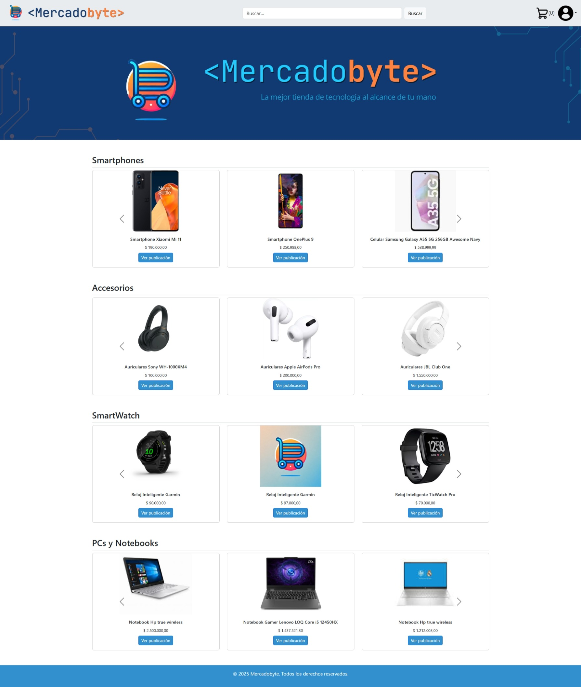
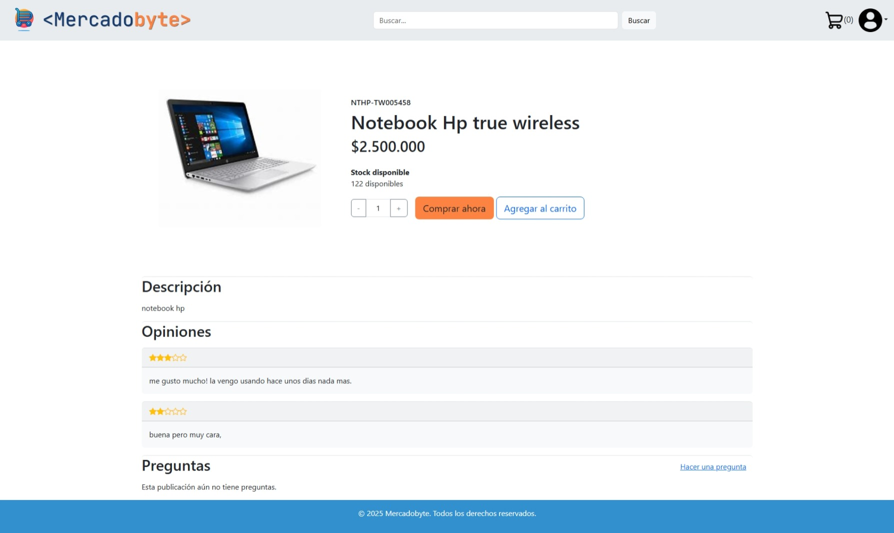
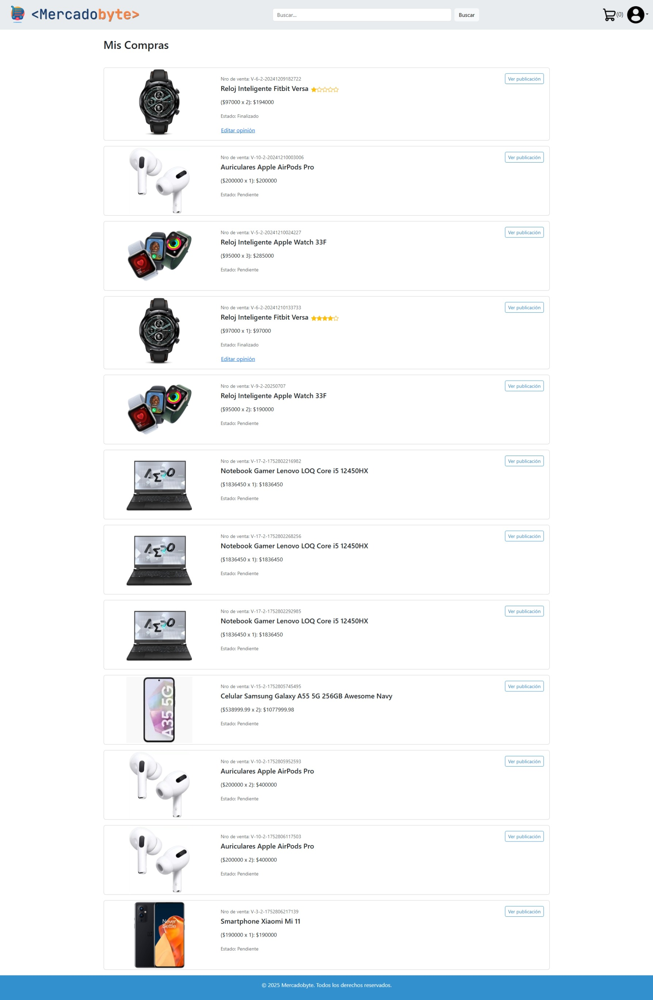
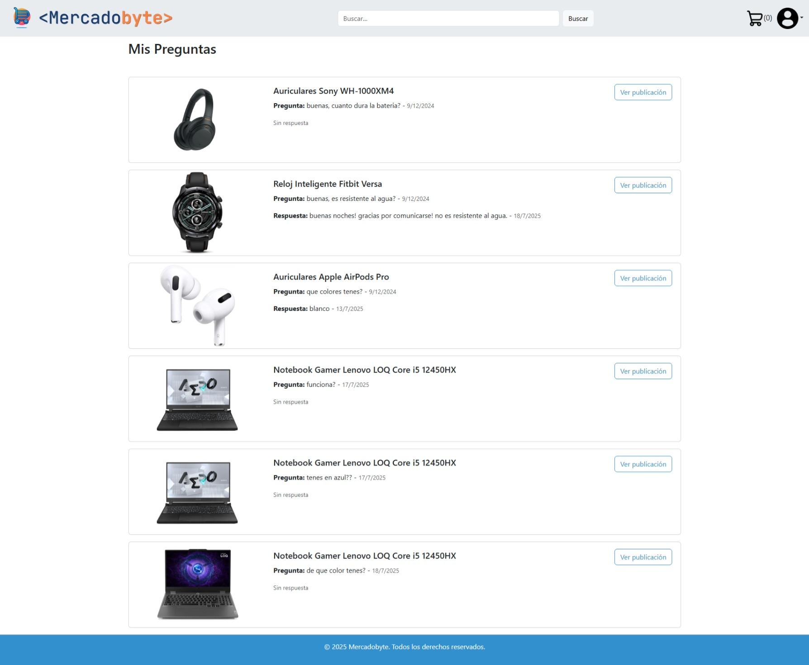
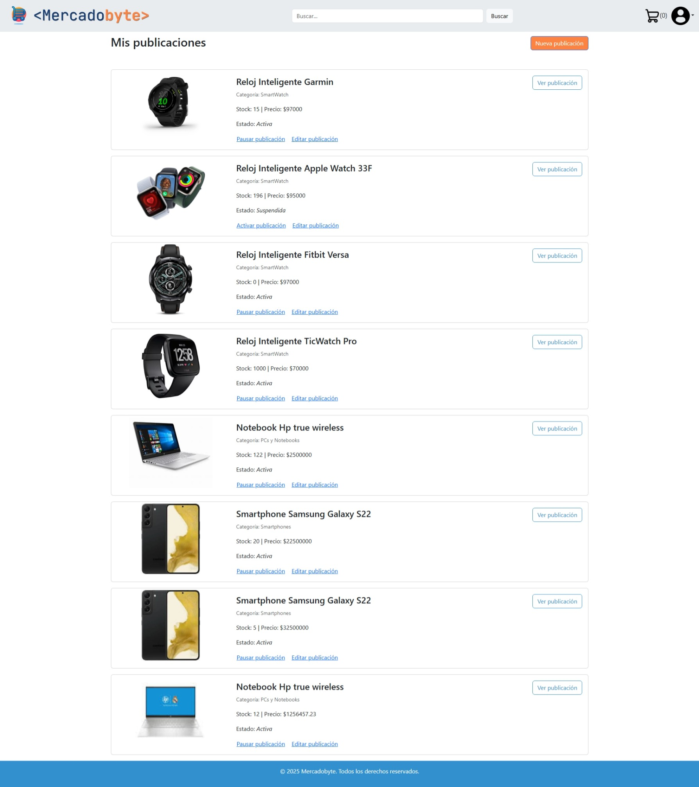
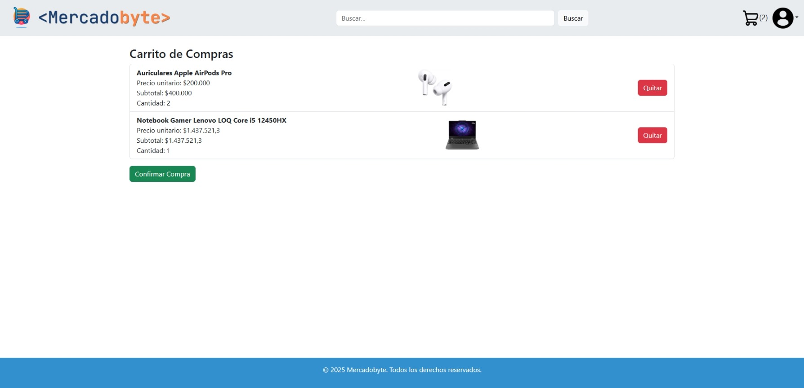

# 🛒 MercadoByte

Marketplace de productos de tecnología con autenticación, compras, y gestión para usuarios y administradores.

---

## 📌 Descripción

MercadoByte es una aplicación web. Permite a los usuarios registrarse, comprar productos tecnológicos, hacer preguntas, dejar opiniones y gestionar sus compras. Los administradores pueden administrar productos, categorías, ventas y publicaciones.

---

## 🛠️ Tecnologías utilizadas

### Frontend (React)

- React + React Router DOM
- Axios
- Bootstrap / React-Bootstrap
- Context API (Redux en proceso)
- Formularios y validaciones
- Modales y estado global

### Backend (Express)

- Node.js + Express.js
- Sequelize (ORM)
- SQLite (como base de datos local)
- JSON Web Tokens (JWT) para autenticación
- CORS y Middlewares personalizados

---

## 📂 Estructura del proyecto

```
mercadobyte/
├── src/            → Código del frontend en React
├── api/            → Backend Express + SQLite
├── public/         → Archivos estáticos del frontend
├── mercadobyte.db  → Base de datos SQLite
```

---

## 🚀 Cómo ejecutar el proyecto

### 1. Clonar el repositorio

```bash
git clone https://github.com/tu_usuario/mercadobyte.git
cd mercadobyte
```

### 2. Instalar dependencias

#### 🔧 Backend

```bash
cd api
npm install
```

#### 💻 Frontend

```bash
cd ../src
npm install
```

### 3. Ejecutar el proyecto

#### 🔙 Iniciar Backend

```bash
cd api
nodemon api.js
```

El backend corre en: `http://localhost:3000`

#### ▶️ Iniciar Frontend

```bash
cd ../src
npm start
```

El frontend corre en: `http://localhost:5173` (o el puerto que indique Vite)

---

## 🧪 Base de Datos

Este proyecto utiliza **SQLite**, y la base de datos está preconfigurada con el archivo:

```
api/mercadobyte.db
```

> No requiere instalación adicional, ya está listo para usar.

---

## 🧑‍💻 Autora

Desarrollado por **Camila Losada**  
Proyecto Final – Programación Web 2 – UCES – 2025

---

## 🖼️ Capturas de pantalla

### Vista de inicio



### Vista de publicación



### Vista de Compras



### Vista de Mis Preguntas



### Vista de Mis Publicaciones



### Vista del Carrito


